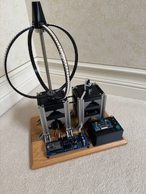

### POV_Sphere
 ESP32 Arduino sketch: SK9822 (DotStar) driven with DMA, double-buffered,
 4x-per-revolution, and one SPI channel serially multiplexing the DMA streams
 to the dotStar strips.

### Hardware assumptions:
 Hardware Details:
 * ESP32 using core-0 for the slow stuff: UI, menu, rotary-switch inputs, motor control.  
               Witn core-0 we set up three freeRTOS tasks: graphics, motor, and UI,  
               Each task has its own loop time. highest priority- motor. Middle priority- graphics
               lowest priority - UI/rotary-encoder.
               core-1 is used for the fast stuff: framebuffer reading, DMA, LED strip rendering.
 * SK9822 / DotStar LED chains: 4 rings, each 48 LEDs (total framebuffer 120x48).
 * A SN74AHCT125 tri-state bus buffer to switch MOSI to one of 4 rings.
 * AS5600 magnetic encoder is used to monitor the Sphere shaft angle to adjust motorRPM, synchronize
   a core-1 PLL.  A PLL is used to match the shaft angular speed to calculate the current shaft angle
   and speed.  The magnetic encoder is slow and is only read at about a 100hz rate so we only use it 
   to generate an error correction signal for the faster PLL frequency. The angle measured in core-0
   is compared to the core-1 PLL angle and the error component is computed to correct and lock the PLL.
   The code for this is in the motor class.

### Image creation:
 * Images are imported into Gimp then scaled to 120x48 and exported using the File->"Export as C-source" format.
   The only options to set in the export form are "Use GLib types (guint8)" and "Save as RGB565 (16-bit)".
 * Edit the file include/images.h and add the file that was exported.  Add a wrapper for it:
  const Image ImageNameWrap = {
    .name = "ImageName",
    .width = ImageName.width,
    .height = imageName.height,
    .bytes_per_pixel = ImageName.bytes_per_pixel,
    .pixel_data = ImageName.pixel_data
  };

 * Finally, add an entry into the enum ImageID {} list and the imageTable[IMG_COUNT] array to the images.h file.
  The code for this is in the graphicsAssets class.

### Graphics Generation
 * There are graphics primitives (draw pixel, line, rectangle, etc.) in the graphicsPrimitives class.
 * Composites (drawings that call the primitives to build complex shapes) are in graphicsComposites.
 * Animations (moving shapes, algorithmic generators) are in the graphicsAnimations class.
 * Scenes (state and timeline based animations) are in the graphicsScenes class.
 * A graphicsParticles class was created to hold special "star" elements.  These are pixels that paint then fade.  
   Used to create shooting stars, fireworks, etc.
 * Functions with the name fillBB_<name> are algorithmic generation of patterns.  They are phase based and compute
   the colors around the globe in terms of a periodic frequency, phase, cycle all derived from the absolute millis() time.
   Then we scan the rows/columns of the framebuffer, loading the computed color into the available LED locations.  Think of 
   it as the functions can compute color for any spot on the Sphere,  the framebuffer loads its more sparsely available 
   points by reading the sphere colors at those points.
 * Edit the images.h file to add wrappers for each of the animation functions.  The functions themselves are in the images.cpp file.
   Code 

### Power
 * The POV_Sphere is powered from a 12v battery (3s2p lithium).  There is a charge jack on the battery case.
   A BMS is built in so you only need to supply 12.6-13v and it will limit the charge to the batteries.  

 * *** NOTE: Do not turn on the power switch or run the Sphere while charging the batteries.

 The majority of this code was written by colaborating with chatGPT.  I modified by add menu specifics, hardware specifics, etc.
 dlf 12/28/2025

### Schematics

### Build Pictures

