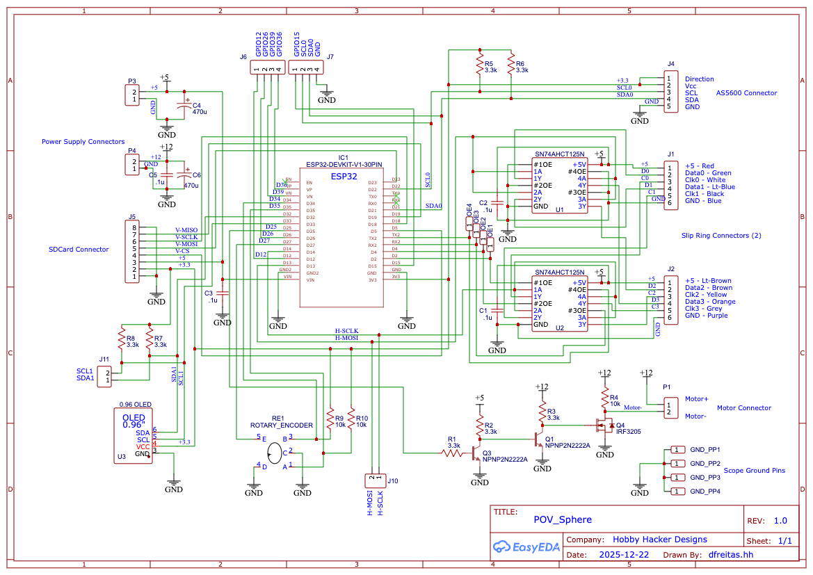
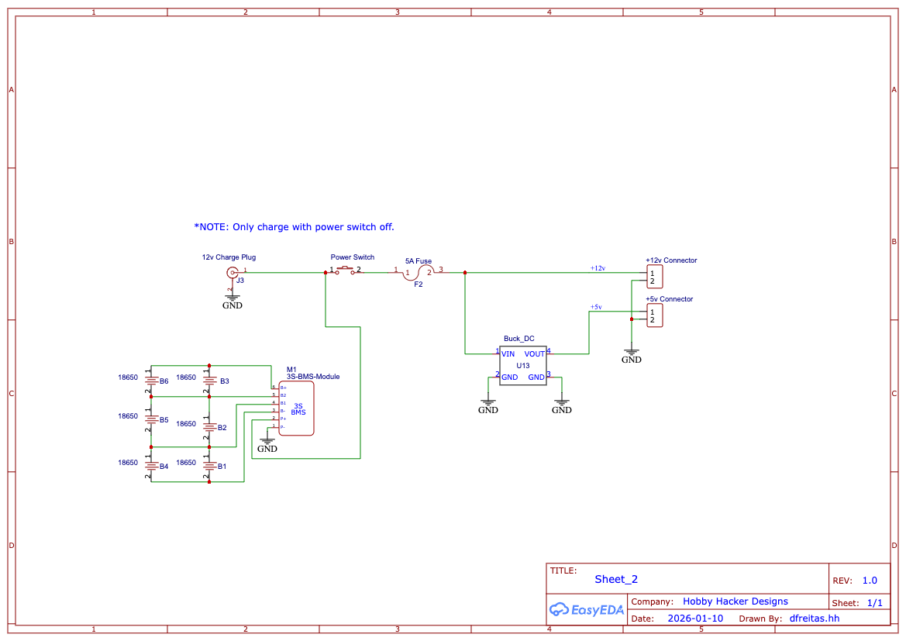
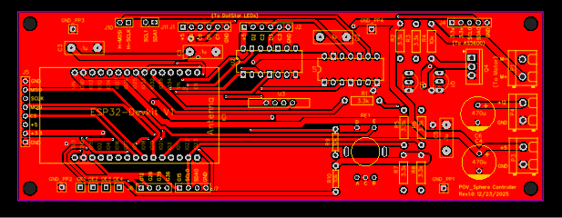

### POV_Sphere
 ESP32 Arduino sketch: SK9822 (DotStar) driven with DMA, double-buffered,
 4x-per-revolution, and one SPI channel serially multiplexing the DMA streams
 to the dotStar strips.

### Hardware assumptions:
 * ESP32 using core-0 for the slow stuff: UI, menu, rotary-switch inputs, motor control.  
               core-1 for the fast stuff: framebuffer reading, DMA, LED strip rendering.
 * SK9822 / DotStar LED chains: 4 rings, each 48 LEDs (total framebuffer 120x48).
 * A SN74AHCT125 tri-state bus buffer to switch MOSI to one of 4 rings.
 * AS5600 magnetic encoder is used to monitor the Sphere shaft angle to adjust motorRPM, synchronize
   the core-1 PLL.
 * Using a 128x64 OLED and rotary-encoder/switch for a simple menu system for user controls. 

### Image creation:
 * Images are imported into Gimp then scaled to 120x48 and exported using the File->"Export as C-source" format.
   The only options to set in the export form are "Use GLib types (guint8)" and "Save as RGB565 (16-bit)".
 * Edit the file include/images.h and add the file that was exported.  Add a wrapper for it:
  const Image ImageNameWrap = {
    .name = "ImageName",
    .width = ImageName.width,
    .height = ImageName.height,
    .bytes_per_pixel = ImageName.bytes_per_pixel,
    .pixel_data = ImageName.pixel_data
  };

 * Finally, add an entry into the enum ImageID {} list and the imageTable[IMG_COUNT] array to the images.h file.

### Controls
 *  A rotary/switch encoder is the input device.  A 128x64 OLED is the menu display.  Rotate the knob to select
    a menu item.  Click to select the command.  Some commands allow you to enter a value by rotating the knob.
    Some commands execute with another click.  Double-click to exit a command or return from a sub-menu.

### Power
 * The POV_Sphere is powered from a 12v battery (3s2p lithium).  There is a charge jack on the battery case.
   A BMS is built in so you only need to supply 12.6-13v and it will limit the charge to the batteries.  

 * *** NOTE: Do not turn on the power switch or run the Sphere while charging the batteries.

 The majority of this code was written by colaborating with chatGPT.  I modified by add menu specifics, hardware specifics, etc.
 dlf 12/28/2025

### Schematics

### Build Pictures

